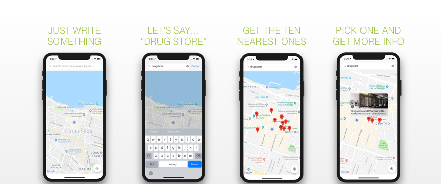

<h1 align="center">
    
    <br>
    <br>
</h1>

<br>
<br>

<p align="center">
    🗺️ Type once. Get what you want. The nearest ones. That's it. 🗺️
<br>
<br>

## Table of Contents


- [The App](#the-app)
- [Getting Started](#getting-started)
- [Further Work](#further-work)
- [License](#license)


## The App

A simple app, written in *Swift 4*, which aims to show the nearest places around you, given a search term. Example: If you search for something like *drug store*, your should then see on the map the ten nearest drug stores.



## Getting Started

### Basic Steps

Clone the repository.

```sh
git clone git@github.com:pogist/PlaceFinder.git
```

`cd` into the directory.

```sh
cd PlaceFinder
```

### Up and Running

Before you build and run the app for the first time, place this struct on any part of the project, but not on a test target, and provide your API key as follows:

```swift
struct DefaultKeyProvider: KeyProvider {
    
  var googleMapsAPIKey: String {
    return "Your api key goes here..."
  }
}
```

## Further work

### Code/Environment Improvements

#### Reactive bindings with RxSwift

In this small scenario – a quite simple app which's got almost no User Interaction or API calls –, adopting reactive bindings (e.g. [RxSwift](https://github.com/ReactiveX/RxSwift)) could be considered overengineering. In a real world scenario, we could have asynchrony simplified by writing declarative code – which, on its turn, could lead us to a cleaner code and architecture. Last but no least, multithreading is then simplified by using reactive operators to react to changes on different threads.

#### Adopt a functional programming utility belt

Swift is such a great language which brings out-of-the-box a few features that allows us to do the functional programming 101 – besides a powerful and expressive type system. But **maybe** having third-party support for introducing new data structures, functions and other functional primitives would help the team achieving more powerful abstractions and, as consequence, cleaner code and architecture. One candidate to do so would be [Swiftz](https://github.com/typelift/Swiftz).

#### Store sensitive data with environment variables

Instead of using a simple Struct to handle sensitive data, we could store API keys and related stuff on environment variables via Xcode Schemes – which would be useful for building with these data on Continuous Integration services as well; which takes us to the next point:

#### Continuous Integration

Having something to automate build, testing and support cycles would be quite interesting. Theoretically, any good player on the CIs market would handle this – but maybe one that is mobile-focused would be an even better fit – e.g. [Bitrise](https://www.bitrise.io/features/ios-features). Also, using a hosted static analysis server focused on best practices-compliance would be great to keep the team on our toes – something like [Codebeat](https://codebeat.co/ios) might be quite enough. 

#### Adopt a linting tool 

Again, on a small PoC like this app, it might sound a bit of overengineering. But the personal nature of coding style such a challenge in a team atmosphere. It turns out that using a linting tool – which is synchronized with a style guide provided by the team –, e.g. [SwiftLint](https://github.com/realm/SwiftLint) is probably the best way to handle this.


### Experience-wide Improvements

#### SiriKit

Besides the fact that Siri and Maps already do this and the app has almost no user interaction, the experience can still be largely improved using voice commands and eliminating the necessity to type anything – leading to a whole new hands-free using experience.

#### WatchOS

Many iOS users also own an Apple Watch and quite used to having the wearable as an extension of the experience they have on the mobile phone – so having a simple watchOS extension with maybe a reduced version of the map – or a SiriKit integration – would mean more for the final user.

## Credits

[Map](https://thenounproject.com/term/map/1289713) by Aidan Cooke from the Noun Project.

## License

**PlaceFinder** is available under the MIT license. See the [LICENSE](LICENSE.md) file for more info. 
